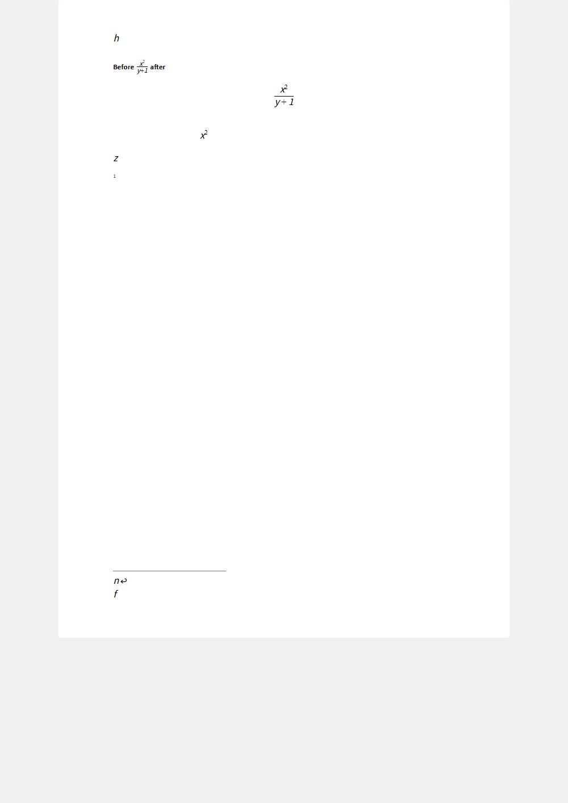

# Read MathType and export native Word equations

This is an experimental **PaperAI fork** feature, not an upstream OfficeCLI release. It reads a supported subset of embedded MathType MTEF v5 and writes editable Word OMML (`m:oMath` / `m:oMathPara`) into a **new DOCX**. It does not insert formula screenshots, automate MathType, require Office, or implement a new formula editor. Existing `view` and editing commands work with the converted native equations.

## Commands

```sh
# Read mathematical content and check support; never creates a document.
officecli convert-equations source.docx --dry-run --json

# Require every detected embedded equation to convert; output must not exist.
officecli convert-equations source.docx --out native.docx --json

# Explicitly allow a MIXED document: supported equations become OMML,
# unsupported equations stay as their original OLE objects.
officecli convert-equations source.docx --out mixed.docx --preserve-unsupported --json

officecli validate native.docx --json
officecli view native.docx text
officecli view native.docx html -o native.html
```

Exactly one of `--dry-run` and `--out` is required. `--preserve-unsupported` can also accompany a dry run to report unsupported objects as warnings. Exit code **0** means the requested operation succeeded; **1** means conversion, input, or argument validation failed. Conversion errors never produce a partial output file. Existing output files and in-place conversion are refused. Close any resident editing session explicitly before conversion if its unsaved changes should be included; the converter reads the on-disk source without saving it.

## What is supported

- Transitional, non-macro DOCX packages; embedded `Equation.DSMT4` / `Equation.3` objects with a valid `Equation Native` stream containing **MTEF v5**.
- Unicode variables/operators, verified MathType virtual spaces, fractions, roots, postfix/prefix scripts, common delimiters, large operators with limits, limits, braces, matrices without partition rules, multiline piles and common accents/primes.
- Equations in paragraph runs, including mixed text, tables, headers, footers and footnotes. A display equation becomes `m:oMathPara` only when it is the paragraph's sole content; otherwise it stays an inline `m:oMath` without moving surrounding content.
- XML parts are discovered by OPC content type as well as the `.xml` extension; differently named header parts are not skipped. Equation producer matching is case-insensitive.
- Existing OMML and unrelated OLE objects remain intact. Run formatting on adjacent text is retained. Shared VML shape definitions are retained for other previews.

Word controls the native formula font, sizing, spacing and alignment. MathType-specific typography, nudges and custom layout are **not pixel-preserved**; a `math_layout_normalized` warning reports this. The supported mathematical structures, Unicode characters, bold/italic styles and RGB character colors are retained.

The converter matches main-document and XML part names case-insensitively, as required by [OPC URI equivalence](https://learn.microsoft.com/en-us/dotnet/core/compatibility/core-libraries/8.0/system-io-packaging-case-insensitive-uri). For example, a relationship to `/WORD/DOCUMENT.XML` can identify the ZIP entry `word/document.xml`. The actual entry is still checked for a Word document root and body; output preserves the original ZIP entry names. Case-only duplicate entries remain ambiguous and are rejected.

The bundled `System.IO.Packaging 8.0.1` has a separate [content-type Override lookup limitation](https://github.com/dotnet/runtime/issues/112783): a case-mismatched Override without an applicable Default can be rejected by the underlying reader before conversion. This patch does not normalize the package manifest or change that dependency. A reader rejection is not by itself proof that such a package violates OPC.

Unknown records, template variants, private character mappings, font-only character encodings, floating/linked objects, unsupported containers, CMYK colors and matrix partition rules are not guessed. Older **MTEF v3**, AxMath, empty objects, some accents and specialized templates remain unsupported. The producer name alone does not prove conversion support. A document that passes OpenXML validation may still contain binary equations the converter cannot interpret.

Default export fails if any equation is unsupported. `--preserve-unsupported` is an explicit opt-in to a mixed native/OLE document, **not** evidence that every equation is editable as Word math. Unsupported payloads remain opaque: their mathematical structure cannot be validated by this parser. Malformed supported MTEF, invalid CFB/header lengths, malformed XML and missing internal relationship targets still fail. External relationships are never fetched and OLE servers are never activated.

Conversion is not a replacement for document validation: run `validate` on the result separately. On upstream v1.0.146, the HTML table renderer can omit text adjacent to native inline equations; that independent preview defect is fixed separately from this converter. The exported DOCX and text view retain the text.

## JSON

The result has top-level `success`, `data`, `warnings` and `errors`. Each diagnostic includes a stable `code`, a reason and, when applicable, a package `part`, `objectIndex` and `byteOffset`. Object indices are one-based OLE positions within the part, including non-equation objects. Errors thrown before equation enumeration use the existing CLI `error` object.

| Data field | Meaning |
| --- | --- |
| `dryRun`, `output` | Whether no output was requested; successfully written path or `null`. |
| `equations` | Number of detected `Equation.*` OLE objects. |
| `convertible`, `converted` | Number parsed successfully; number actually written as OMML. |
| `unsupported`, `invalid` | Objects with unsupported features; objects with detected corruption. |
| `existingNativeEquations`, `nonEquationObjects` | Existing OMML count and other OLE count. |
| `fullyNative` | No detected equation remains OLE in a successful output. A dry run with embedded equations reports `false` because it did not convert the source. Non-equation OLE objects do not affect this field. |
| `results` | Per-object status: `convertible`, `converted`, `unsupported`, `preserved` or `invalid`. Successfully parsed objects include `latex`, readable `text` and `omml`. |

OMML is the authoritative structured conversion result. `latex` and `text` use OfficeCLI's existing display serializers; they are not a separate lossless interchange format. Diagnostics are not silently removed when preservation is requested. JSON may contain document formulas, so treat reports as document data rather than public telemetry.

The input is opened read-only. Export copies untouched ZIP entry contents byte-for-byte and changes only XML parts containing converted equations. Original embedding payloads, preview resources and their relationships remain in the output for recovery, even when no displayed equation references them; this is **not a sanitization/redaction tool**. Source ZIP compression bytes need not match the new package. Digitally signed packages cannot be exported without explicit signature handling outside this command.

## Verification

All fixtures are generated in tests from synthetic mathematical records and neutral text. No user document, extracted equation payload or proprietary MathType program is distributed.

Fork builds use `1.0.146-paperai.1` for both managed tests and native publishing. Keep the `<upstream>-paperai.<revision>` format: the fork's fixed-version update protection recognizes `-paperai.`, so feature names belong in artifact labels, not in that suffix. The MathType workflow shares one `PAPERAI_VERSION` across all builds and checks the published executable's `--version` before running its tests.

```sh
dotnet test tests/OfficeCli.Tests/OfficeCli.Tests.csproj -c Release -p:Version=1.0.146-paperai.1
dotnet publish src/officecli/officecli.csproj -c Release -r win-x64 --self-contained true -p:PublishSingleFile=true -p:PublishTrimmed=true -p:Version=1.0.146-paperai.1 -o .artifacts/native
```

For Windows executable tests and synthetic reviewer artifacts (use a new, empty artifact directory):

```powershell
$env:OFFICECLI_TEST_BINARY = (Resolve-Path .artifacts/native/officecli.exe).Path
$env:OFFICECLI_MATHTYPE_ARTIFACTS = Join-Path $PWD '.artifacts/synthetic'
& $env:OFFICECLI_TEST_BINARY --version # Must report 1.0.146-paperai.1.
dotnet test tests/OfficeCli.Tests/OfficeCli.Tests.csproj -c Release -p:Version=1.0.146-paperai.1
```

The suite checks operand ordering, OMML schema validity, corruption/unknown-feature rejection, CLI JSON and exits, mixed-content preservation, HTML formulas, and normalized OMML equality after changing adjacent text with `WordHandler` and saving. CI runs the tests on Windows, Linux and macOS and additionally tests the trimmed Windows x64 executable. No Release or npm publish is performed by this workflow.

When combined with the fork's release/update-protection changes, the same unfiltered suite also runs `PinnedForkTests`: staged updates must remain untouched, `config autoUpdate` must report `false`, enabling it must fail, and `__update-check__` must be a no-op. Keep `OFFICECLI_TEST_BINARY` pointed at the published executable and pass the same `Version` to `dotnet test`; testing only the default managed build does not verify the native artifact's protection. The MathType conversion changes alone do not implement update protection.

OPC name regressions use synthetic documents that the SDK first opens and validates. They exercise uppercase/lowercase relationship targets and ZIP names, XML parts without an `.xml` extension, dry-run and export counts, unchanged input/untouched part bytes, output validation, invalid document roots, and case-only duplicate parts. Run them with `dotnet test tests/OfficeCli.Tests/OfficeCli.Tests.csproj -c Release --filter 'FullyQualifiedName~MainPartCasing|FullyQualifiedName~XmlContentTypeFinds|FullyQualifiedName~CaseOnlyDuplicate'`.

Large-operator records are interpreted as body, lower limit, upper limit, then operator glyph. This order is verified against native MathType records and their previews, and agrees with the independent [transpect summation](https://github.com/transpect/mathtype-extension/blob/master/xsl/transform/sum.xsl) and [integral](https://github.com/transpect/mathtype-extension/blob/master/xsl/transform/int.xsl) implementations; the upper-before-lower listing in the WIRIS format reference does not match those records. Synthetic regressions assert distinct operand values in nested sums, one-sided and absent limits, both limit-position modes, and numerically reversed bounds. The CLI regression checks the same values in dry-run JSON and exported OMML, then verifies that an adjacent-text edit preserves them. It can be reproduced with `dotnet test tests/OfficeCli.Tests/OfficeCli.Tests.csproj -c Release --filter FullyQualifiedName~Summation`.



The MTEF reader is independently implemented from the [WIRIS MTEF v5 format reference](https://docs.wiris.com/en_US/mathtype-mtef-v5-mathtype-40-and-later). Unsupported encodings are deliberately explicit rather than inferred from a preview image. The fork retains OfficeCLI's Apache-2.0 license and notices.
